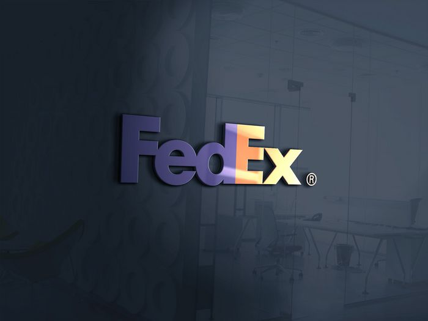
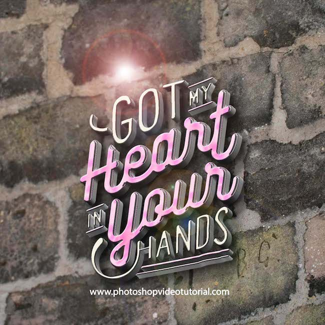
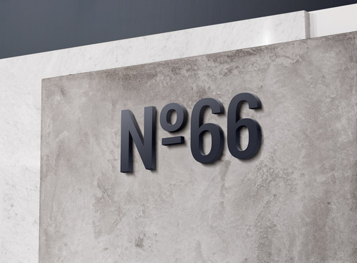
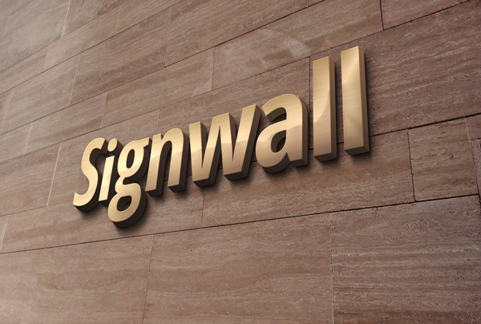
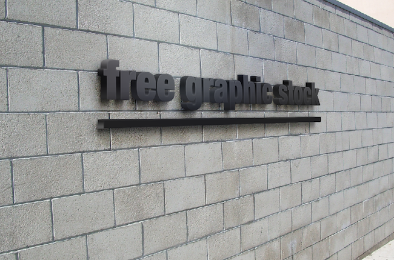
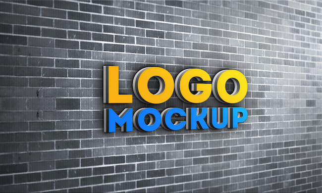

So you have designed a logo for your client or maybe it’s for your self and now you want to showcase it to your client or friends and family on a 3D wall. For logo designers, it’s really important that how they present their logo’s to people and mockups plays a big role taking your logo to an extra mile. It’s really hard to find a nicely designed well layered 3D logo mockups these days and you can find many crappy designs, as well as some designs, are designed a decade ago.

Here I’m gonna list 7 3D wall logo mockups that will help your logo designs to stand out. Which are well designed and layered. Not the ones that have published many many years ago. So here we have gathered 7 3D wall logo mockup templates that extremely high quality. Feel free to use them on your personal as well as commercial projects.

You may also like: [Best Free PSD Logo Mockup](psd-logo-mockups)

## [3D glass window logo mockUp](https://gumroad.com/l/YDeEz/free)

This beautiful glass background based mockup will help you to showcase your logo in a beautiful way. Just put your logo into the smart object in photoshop and you are good to go. Feel free to change the position of your logo. To download this you have to share your email with them, but its definitely worth it!

## [3D wall logo mockup](http://www.photoshopvideotutorial.com/free-download-3d-wall-logo-mockups/)

This photo realistic 3d wall mockup comes with high-resolution clear 3d glass effect on it. To download this mockup you have to share it on social media, But it’s definitely worth it.

## [Modern 3D display mockup](https://graphicburger.com/3d-wall-logo-mockup-3/)

Create a modern display for your logo design presentation with this high-quality mock-up of a 3D wall mounted sign. The PSD file is easy to customize: choose between the light or dark versions, place your logo on the smart layer, and save the changes.

## [3D wall mockup](https://graphicburger.com/3d-wall-logo-mockup-2/)

This free photorealistic 3d wall mockup is giving depth and shining on your logo and it’s really easy for you to make changes. You have the freedom to add your own logo as well as to change the colors on the wall’s using smart objects. 3D Wooden Logo MockUp.

## [3D wooden logo mockup](https://graphicburger.com/3d-wooden-logo-mockup/)

This mockup got a wooden texture. You can get the wood texture to your logo if you put a .png of your logo with a bit of transparency.

## [3D brick wall logo mockup (light)](http://www.freegraphicstock.com/download/30/)

This PSD template is handy if you want to present your logo as a wall mounted sign or just for nice 3D text effect. With this fully layered PSD file, you can replace the smart object content quickly and easy.

## [3D brick wall logo mockup (dark)](http://www.freegraphicstock.com/download/30/)

Here’s our last 3d mockup. It comes with smart objects and you can place your logo in minutes. This freebie also required your email address for download.

