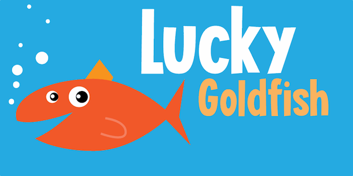
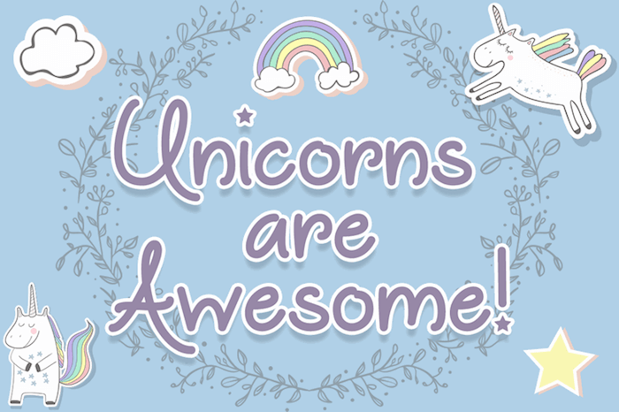
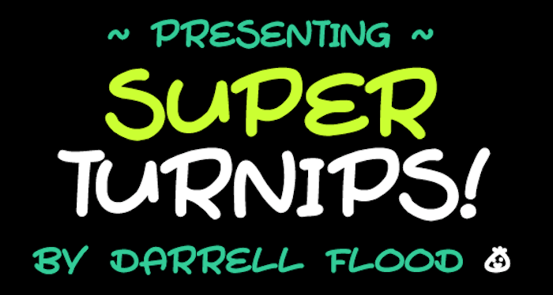

Looking for a font that something funny, creative and stylish? Don’t worry, we got your back.

Some people love Comic fonts and some don’t, this post for that who likes the comic fonts. So we have listed our collection of 30+ unique and creative comic fonts with previews.

Feel free use these fonts to design flyers, poster, banners or anything that needs to look funky and creative. Enjoy the freebies.

## [Crocodile Feet](http://www.fontspace.com/david-kerkhoff/crocodile-feet-demo)

## [Choko](http://www.fontspace.com/m%C3%A5ns-greb%C3%A4ck/choko)

## [Snicker Snack](http://www.fontspace.com/sharkshock/snicker-snack)

## [Blue Sheep](http://www.fontspace.com/david-kerkhoff/dk-blue-sheep)

## [Snacker Comic](http://www.fontspace.com/m%C3%A5ns-greb%C3%A4ck/snacker-comic-personal-use-only)

## [Walter](http://www.fontspace.com/fontomen/walter)

## [Gretoon](http://www.fontspace.com/m%C3%A5ns-greb%C3%A4ck/gretoon)

## [Smiling Cat](http://www.fontspace.com/david-kerkhoff/dk-smiling-cat)

## [Lucky Goldfish](http://www.fontspace.com/david-kerkhoff/lucky-goldfish-demo)

## [Kissy Hugs](http://www.fontspace.com/darrell-flood/kissy-hugs)

## [Wonderbar](http://www.fontspace.com/sharkshock/wonderbar)

## [Jumping](http://www.fontspace.com/darrell-flood/jumping)

## [Juice Monster](http://www.fontspace.com/darrell-flood/juice-monster)

## [Unicorns are Awesome](http://www.fontspace.com/mistis-fonts/unicorns-are-awesome)

## [Pineapple Demo](http://www.fontspace.com/m%C3%A5ns-greb%C3%A4ck/pineapple-demo)

## [Funhouse](http://www.fontspace.com/darrell-flood/funhouse)

## [Pocket Monk](http://www.fontspace.com/chequered-ink/pocket-monk)

## [Mushy Love](http://www.fontspace.com/darrell-flood/mushy-love)

## [Toon Cats]http://www.fontspace.com/darrell-flood/toon-cats)

## [Aine](http://www.fontspace.com/darrell-flood/aine)

## [Stringz](http://www.fontspace.com/darrell-flood/stringz)

## [Villa](http://www.fontspace.com/jake-luedecke-motion-and-graphic-design/villa)

## [Super Turnips](http://www.fontspace.com/darrell-flood/super-turnips)

## [The Bug](http://www.fontspace.com/vvb-designs/the-bug)

## [Gilligans Island](http://www.fontspace.com/mark-riddle/gilligans-island)

## [Twiddlestix](http://www.fontspace.com/sharkshock/twiddlestix)

## [Grumpy Tiger](http://www.fontspace.com/david-kerkhoff/dk-grumpy-tiger)

## [Squirk](http://www.fontspace.com/chequered-ink/squirk)

## [Mojito in June](http://www.fontspace.com/roland-huse-design/mojito-in-june)

## [Dinosaur Cake](http://www.fontspace.com/david-kerkhoff/dinosaur-cake-demo)
