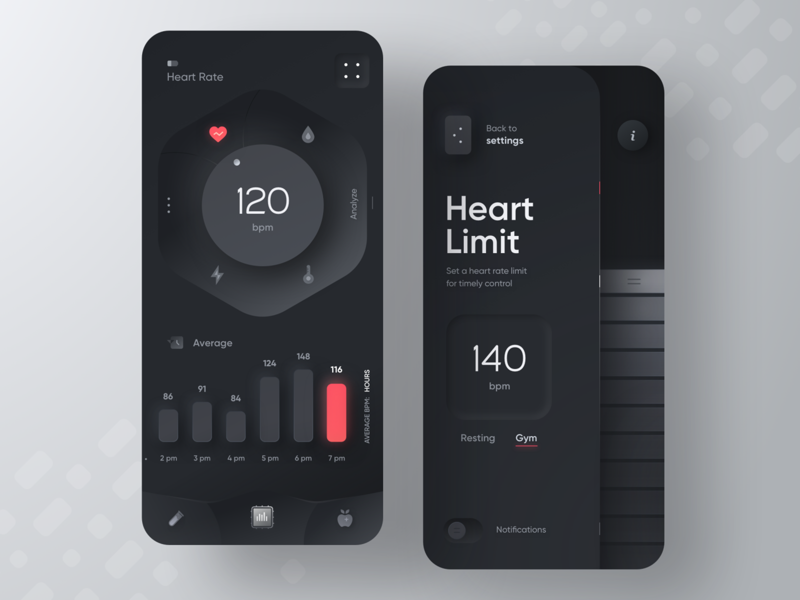
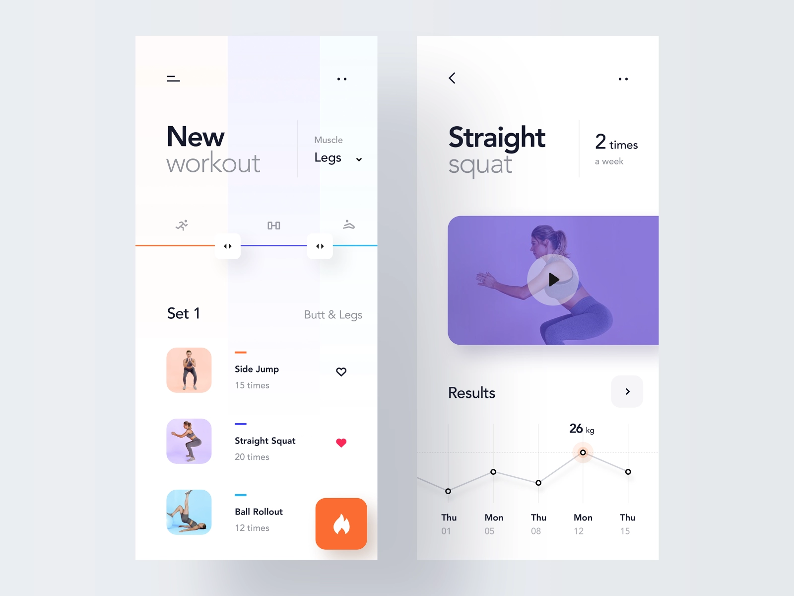
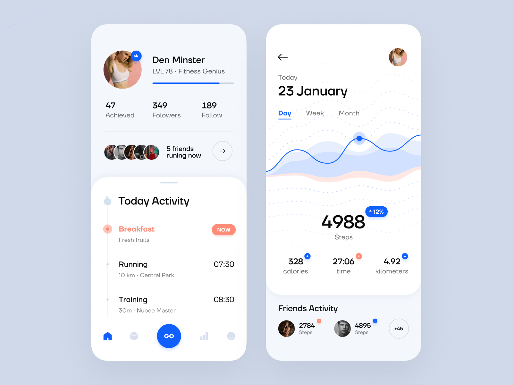
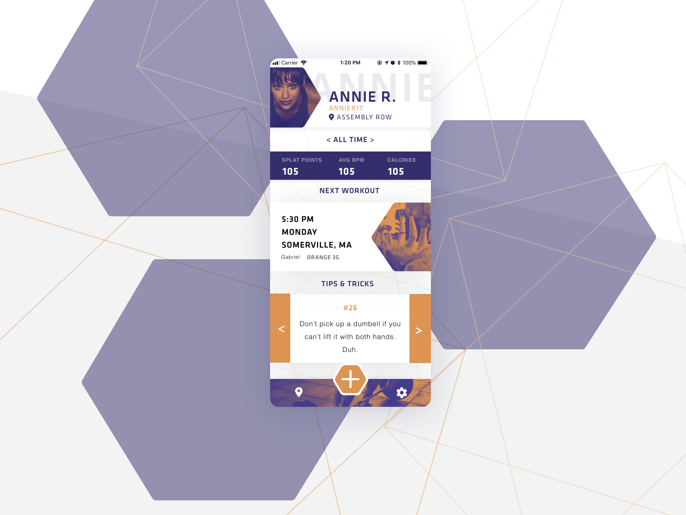
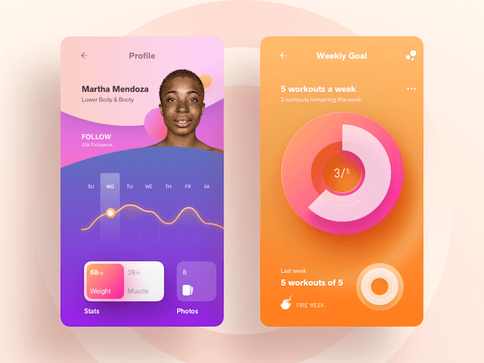
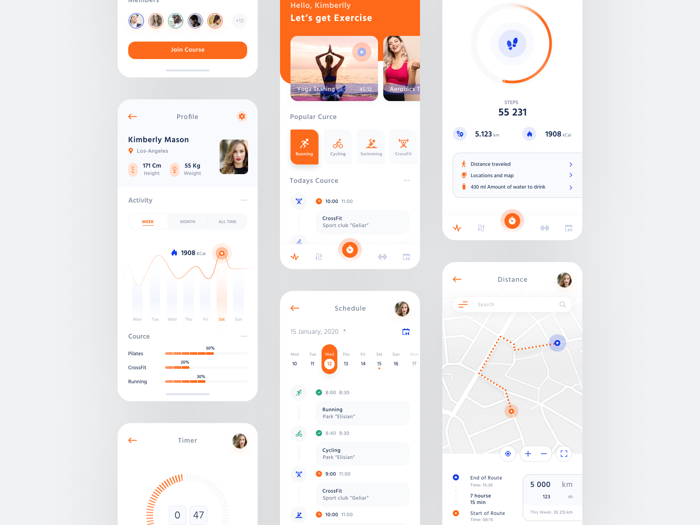
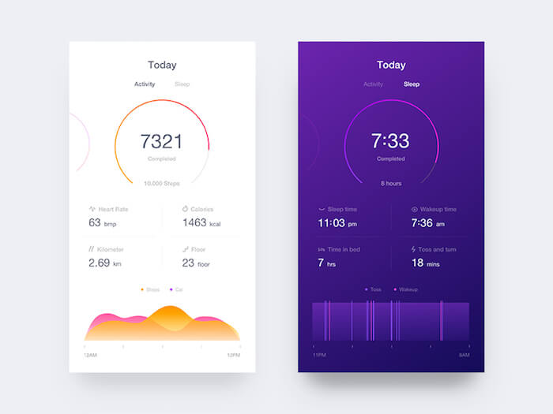

If you are designing a fitness app or developing a fitness app. Getting inspiration from other designs is really helpful. With inspirations, you can get new ideas for your app as well as you can improve your app to look to more professional and attractive.

You may also like: [Best free iPhone X Sketch mockups](iphone-x-sketch-mockups)

## Fitness Device App

## Custom Workout

## Healthy lifestyle

## Profile Page

## Profile and Goals

## Sport App

## Activity and Sleep

