Mockups come in handy when you need to showcase your designs to clients/portfolio in a nice looking way and put your raw designs in real-world environments and objects to see how they look in the real world.

You may find many curated lists of free magazine and book cover mockup articles, With low quality or outdated designs of mockups. So in this article, I’m going to list only the best available [free PSD Mockups](3d-logo-mockup-psd/) of magazine and book covers. All of the curated mockups are free to download and premium quality. Feel free to use them for your personal and commercial projects.

You may also like: [Free A4 Paper PSD Mockups](/free-a4-paper-mockups)

## [2 Free US Letter Size Magazine Mock-Ups](https://zippypixels.com/product/mockups/books-magazines/2-free-magazine-mock-ups-with-stunning-gold-foil-effect-us-letter-size/?utm_source=dribbble.com&utm_medium=referral&utm_campaign=dribbble_sharing)
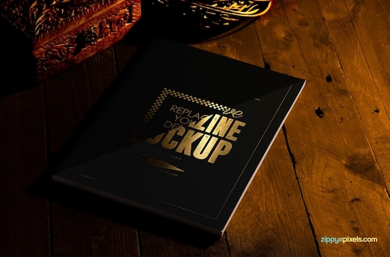

Gorgeously present your magazine, brochure and catalog designs with these 2 free magazine mock-ups in US letter size. Featuring customizable layout design for both cover and inner pages.

## [Free Book Cover Mock-Up](https://zippypixels.com/product/mockups/books-magazines/free-book-cover-mock-up/)
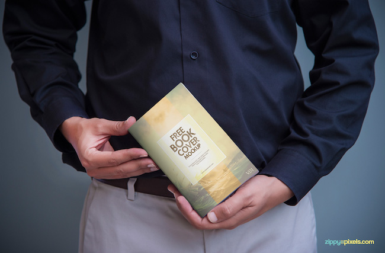

This free book cover mock-up PSD will let you present your paperback designs in a realistic way. This mockup offers smart object option to change the design of the book cover that a man is holding in his hands.

## [Realistic Magazine Cover Mockup](http://blog.graphicspsd.com/free-realistic-magazine-cover-mockup-psd/)
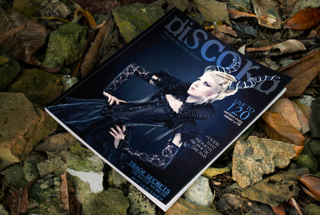

Can use this as a book or ebook mockup but, the main theme of this mockup is specially made for the fashion magazine. This vintage and grungy look will surely make your design amazing.

## [Magazine](https://mockupfree.co/product/magazine-free-psd-mockup)
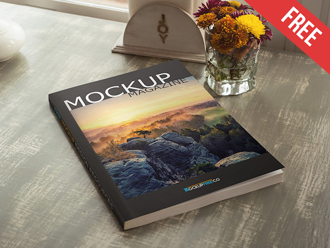

Free PSD Mockup for professional use. Download this awesome mockup PSD for implementing your ideas and achieving different goals and save your time easily with MockupFree!

## [Hand Drawn Sketch Mock-Ups](https://pixelbuddha.net/freebie/hand-drawn-sketch-mock-ups)
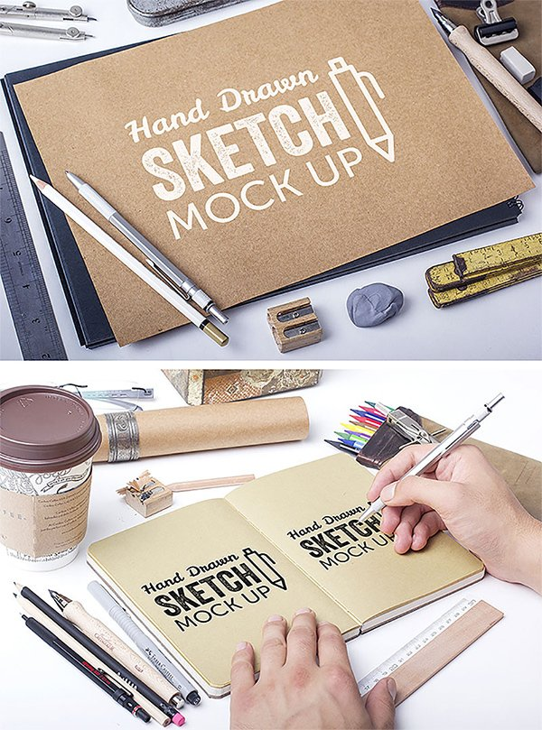

Present your design like it was “sketched» with these 2 beautiful muck-up scenes based on high quality and sharp photographs. A little time-saving trick to show your work.

## [Brilliant Book Mockup Template](https://zippypixels.com/product/mockups/books-magazines/free-book-mockup-template/)
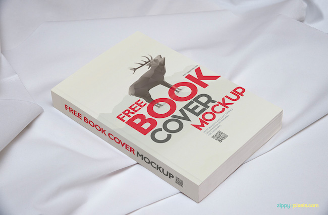

A brilliant and free book mockup template to let you display your beautiful artwork in a professional way. You can change the book cover design just by using smart object option.

## [Psd Magazine Mockup Template US A4](https://www.pixeden.com/psd-mock-up-templates/psd-magazine-mockup-template-us-a4)
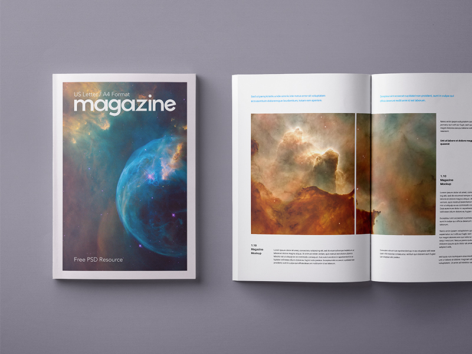

This is an A4 and US letter compatible PSD magazine mockup template to let you showcase your print designs in style. Easily add your own graphics thanks to the smart layer.

## [A5 PSD Magazine Mockup](https://www.pixeden.com/psd-mock-up-templates/a5-psd-magazine-mockup)
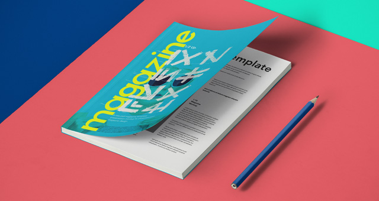

This is a compact style A5 PSD magazine mockup to showcase your editorial designs in style. Easily add your own graphics thanks to the smart layer.

## [A4 Free Magazine Mockup](https://www.behance.net/gallery/52847789/Free-magazine-mockup)
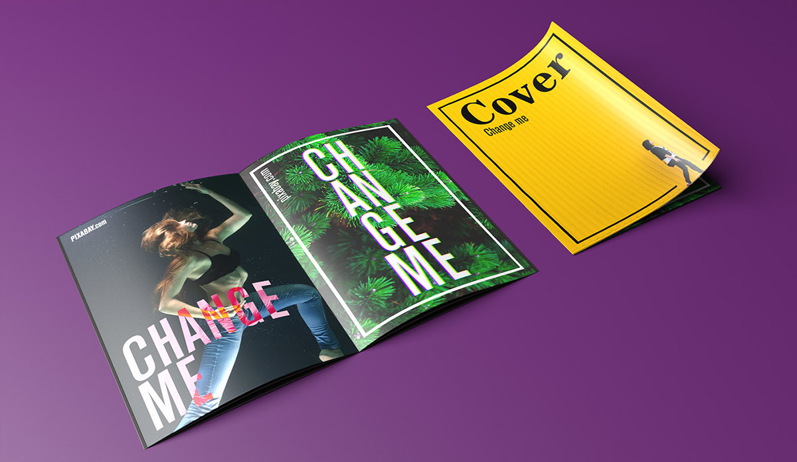

A4 magazine with easy to edit smart objects. You can replace the cover, inside pages and background color.

## [Two US Letter Magazine Mockups](https://zippypixels.com/product/mockups/books-magazines/two-free-us-letter-magazine-mockups/?utm_source=dribbble.com&utm_medium=referral&utm_campaign=dribbble_sharing)
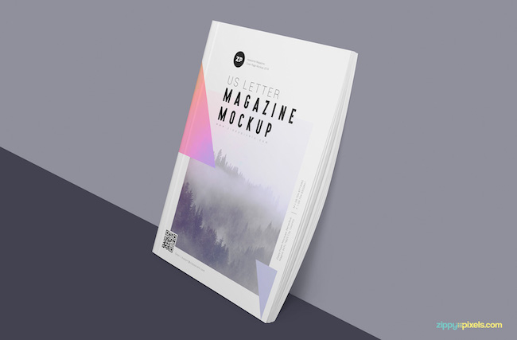

Perfect for designer presentation. Fully layered and easy to edit according to your liking. These free magazine mockups come with a variety of customization options like adjustable shadows, changeable background and floor.

## [Magazine PSD Mockups Vol-2](http://graphiclist.com/magazine-psd-mockups-2/)
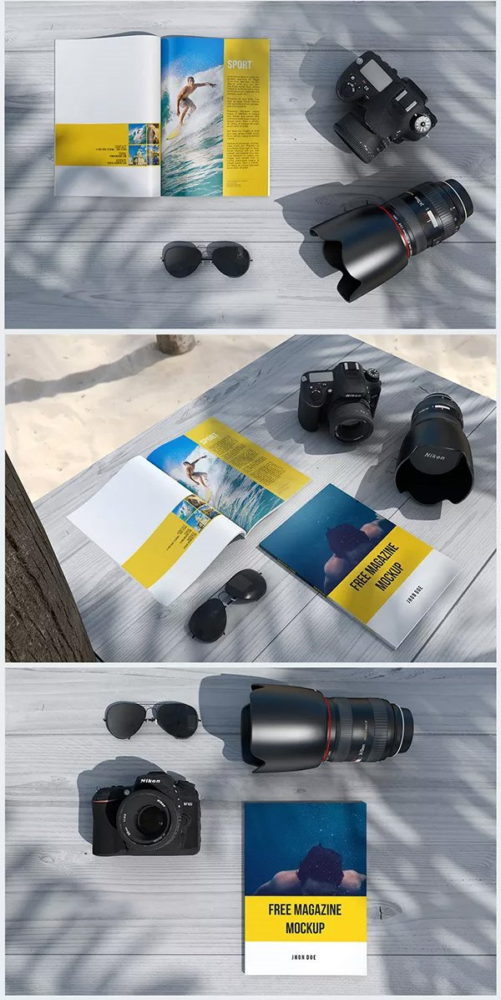

This is great for showing your photography magazine. The PSD file is layered and you can easily place your own design.

## [Free Magazine Mockup PSD](https://zippypixels.com/product/mockups/books-magazines/magazine-mockup-psd-free/?utm_source=dribbble.com&utm_medium=referral&utm_campaign=dribbble_sharing)
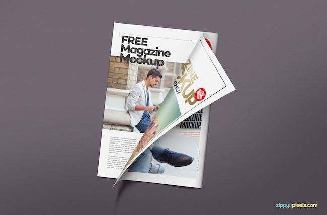

Free and amazing magazine mockup PSD, perfect for the presentation of your designs neatly. This magazine offers changeable designs of the pages plus adjustable shadows, background and light effects.

## [Realistic Book Cover Free PSD Mockup](https://creativepsddownload.com/realistic-book-cover-free-psd-mockup/)
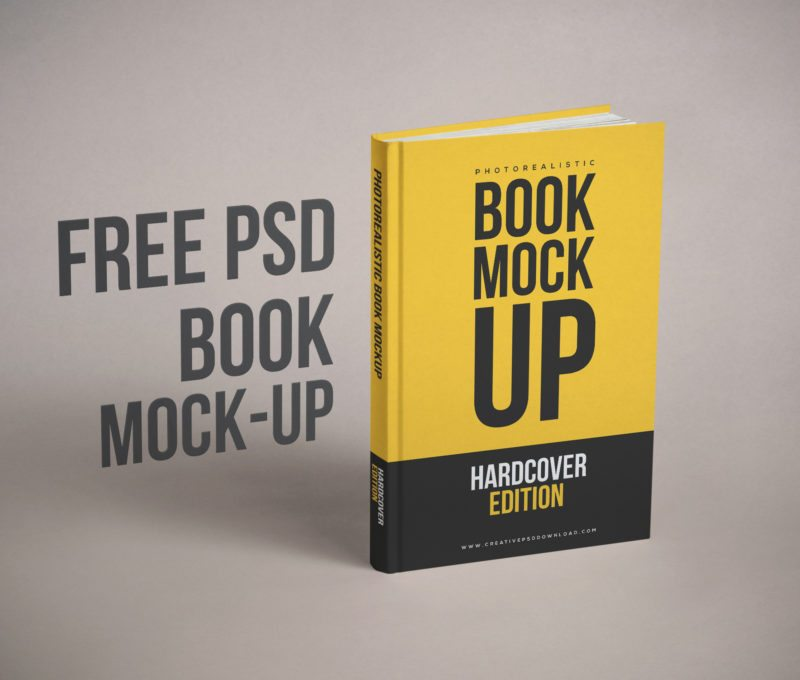

Clean and minimalist Realistic Book Cover and this PSD Mockup is created with high resolution 5000px

## [A4 Magazine Mockup](http://www.elliotlyness.co.uk/Magazine-A4-2000px.psd)
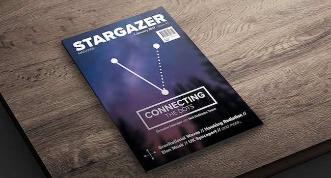

## [Photorealistic Hardcover Book Mockup](https://zippypixels.com/product/mockups/books-magazines/photorealistic-free-hardcover-book-mockup/)
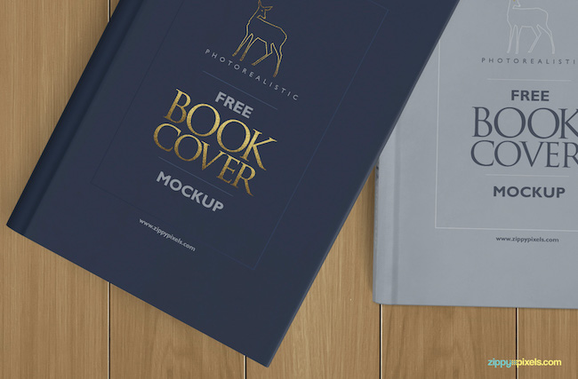

This free mockup offers two different books with the same smart object size. The size of the book cover is 6.3×9.5 inches and the size of bookbinding is 0.9×9.5 inches.

## [Magazine v2 – 2 Free PSD Mockups](https://mockupfree.co/product/magazine-v2-2-free-psd-mockups)

You can easily add there the necessary advertisement and use it for your private and commercial needs. After adding the necessary design, it is possible to create presentations and surprise your future clients.

## [Cat Magazine Mockup](https://thislooksgreat.net/cat-magazine-mockup/)
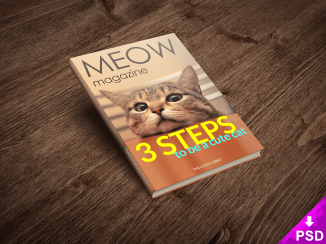

You can use it on your website or whenever you want to promote your products, ideas or articles in a professional but fun way. It is easily editable and you can add your image at each one of the smart objects.

## [Book Cover Mockup Free PSD Template](https://freedownloadpsd.com/book-cover-mockup-free-psd-template/)
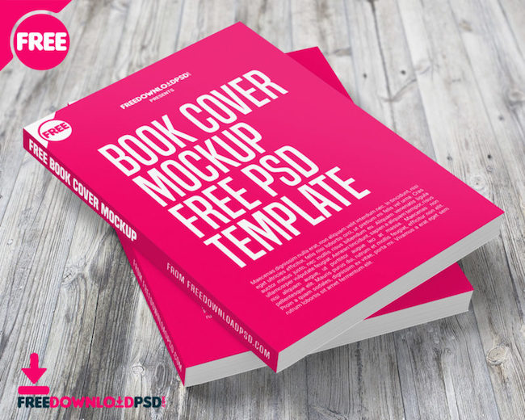

This Top view Book Cover mockup PSD is ideal to showcase your Book Cover and branding designs in a realistic working environment.

## [Hardcover Book Mockups #2](https://www.mockupworld.co/free/set-of-hardcover-book-mockups-2/)
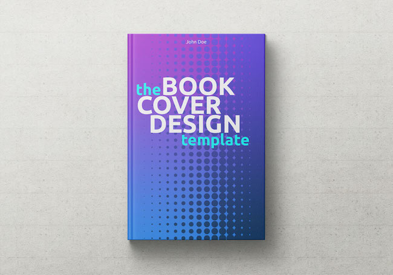

A bundle of four hardcover book mockups, each measuring 2500 x 1750 px. Fully layered PSD files with smart objects.

## [Magazine Mockup](https://www.mockupworld.co/free/set-of-magazine-mockups/)
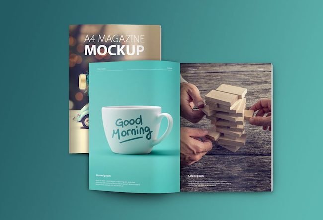

A collection of four PSD files with mockups of an open and closed magazine. Everything is organized in layers. Dimensions: 3000 x 2000 px at 300 dpi.

## [Magazine Cover Mockup](https://thislooksgreat.net/magazine-cover-mockup/)
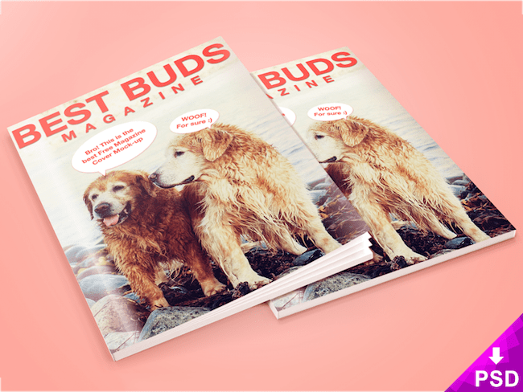

Magazine Cover Mockup with a very realistic feel to it. Use this .psd in any kind of graphic design project, to display your portfolio or to show off apps and software in presentations for both personal or commercial use.

## [Book Mockup](https://www.behance.net/gallery/35449845/Free-Book-Mockup-Psd-Smart-Object)
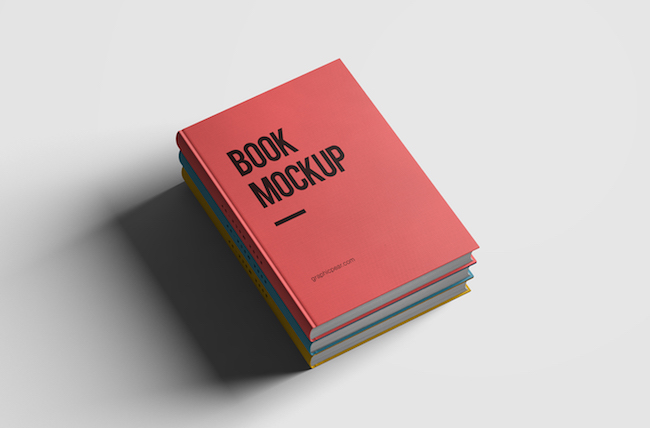

The downloadable mockup file is backed up with a detailed pdf help guide. Everything is fully editable; shadows, lights, colors, textures & backgrounds.

## [Hardback Book Mockup](https://pixelbuddha.net/freebie/hardback-book-mockup)
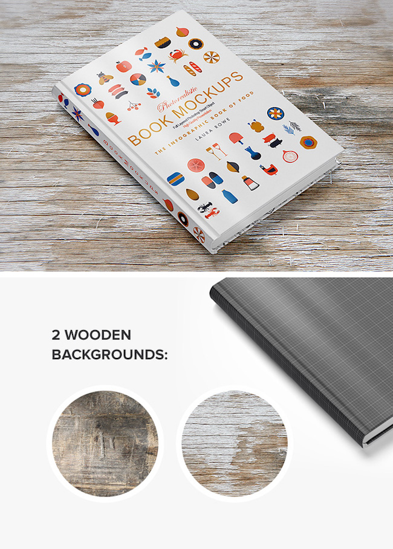

Just get this beautiful, completely customizable hardback book mockup based on the real photo. Quickly change book covers, background textures, and add your artwork using the smart layers. As a bonus, you get 2 wooden background images.

## [Softcover Trade Book PSD Mockup](https://originalmockups.com/mockups/softcover-trade-book-psd-mockup-01-759I18)
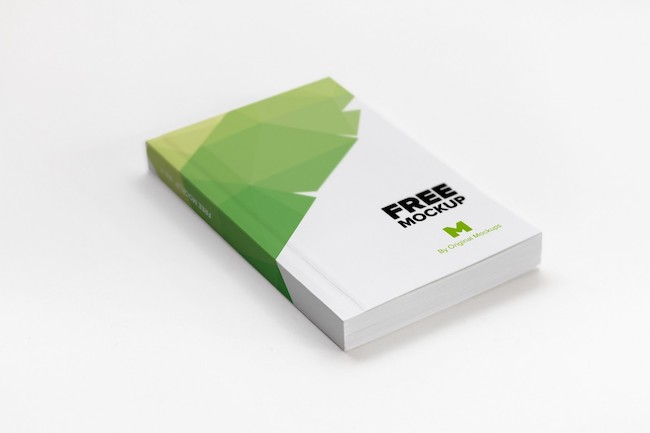

Sophisticated and elegant free softcover trade book mockup designed to make a great clean presentation of the design of your trade books, in this mockup you just have to edit one smart object to customize the entire cover, is really easy to use.

## [Hardcover Book Mockup](http://alienvalley.com/mockups/hardcover-book-mockup/)
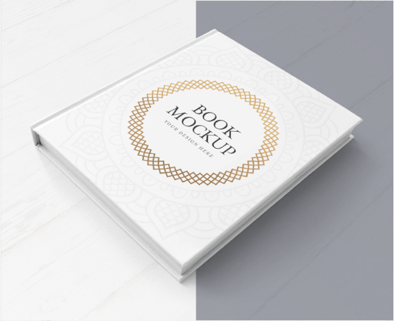

This Hardcover Book Mockup features a set of 2 editable files that showcase a hardcover book from 2 different angles.