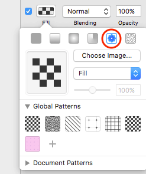
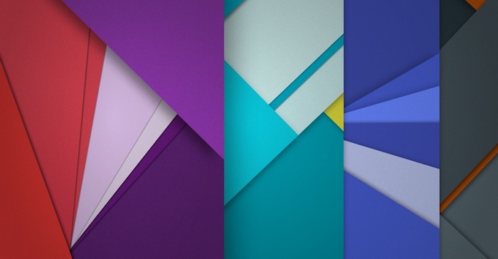

The best way to add patterns to Sketch is downloading a pattern from [subtle patterns](https://www.toptal.com/designers/subtlepatterns/) and then add the .png file to the background of the selected element. They have listed more than 450+ patterns including dot patterns, stripe patterns, and icon patterns as well.

To add downloaded pattern to an element you have to do is **Select the element > Fill > Pattern Fill > Choose the pattern image** you’ve downloaded. Done! It’s simple as that.

We have also collected 3 awesome free Sketch patterns for you. *Click on the top of the pattern to download it.*

